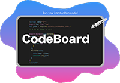
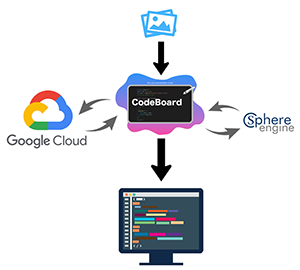
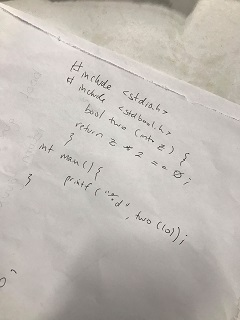
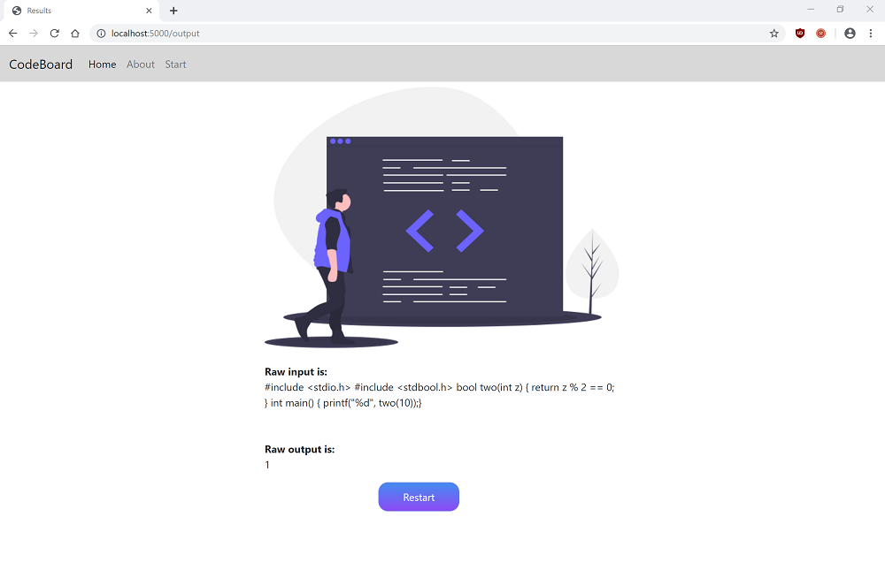

# CodeBoard: Run Your Handwritten Code!

Team Members: Adrian Yung, Jessie Muir, Emily Wang, Vincent Borja

[Github](https://github.com/ayung8/CodeBoard) | Slide Deck

**Summary**  

CodeBoard is a mobile friendly web application built with Python that leverages the latest in AI and Online Automation techniques. CodeBoard allows users to run code wherever it can be found – on paper, on a whiteboard, or even scribbled in sand – simply by taking a picture.

CodeBoard is hosted on Google’s App Engine and utilizes Google’s Cloud Computing as well as Sphere Engine’s Automation Services. The ability to easily parse text from images using Google’s Vision AI paired with Sphere Engine’s online compiler all contributes towards the goal of allowing a seamless conversion from written code to output. 

The application can be used by many: students taking a picture of code scribbled in class by the professor, interviewers quickly running code that is written on the blackboard, and professors checking to see if the solution to an exam question containing 30 for-loops actually works. Evidently, there are a wide range of applications where it would be advantageous to have a quick and easy way to run code simply by taking a picture. 

**Technical Information**  

CodeBoard leverages 2 main APIs: Google Vision and Sphere Engine. Google’s Vision API is fed pictures to analyze and parse text. With this text, CodeBoard extracts relevant information to rebuild bits and pieces of code that might have been lost in translation. Function names, return types, and arguments are all reconstructed to successfully run the code. In addition, CodeBoard validates the code before finally passing it to Sphere Engine’s Online Compiler API for execution. The utilization of both Google’s Vision API and Sphere Engine’s API streamlines the process and drastically reduces the time needed to translate code from paper to output. CodeBoard is hosted using Google’s App Engine.

**Features & How to Use**  

Take a picture of some code! Select the appropriate programming language, as well as indicate whether it is a function or to run it as is (a whole program). You are able to make edits before the code is run.
Currently, CodeBoard supports code written in Javascript and C. Plans to expand to Python, Java, and C++ are already underway!

**Examples:**  

[Click here to try it out!](https://codeboard-257105.appspot.com/)
